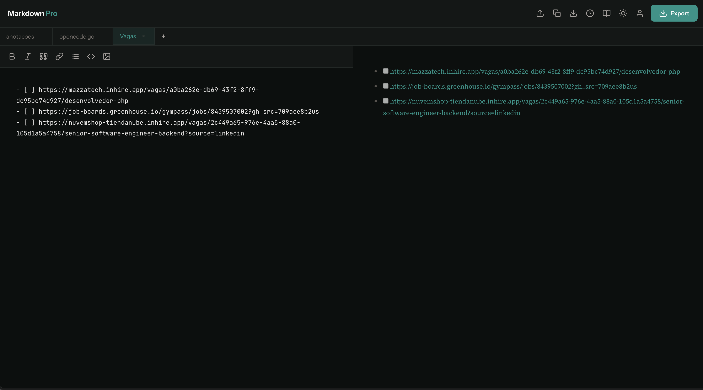

# Markdown Pro



Full-stack Markdown editor with real-time preview, multiple tabs, version history, and export. Built with TanStack Start.

## Stack

- **TanStack Start** — full-stack React framework (SSR, Vite, file-based routing)
- **TanStack Router** — type-safe routing with `scrollRestoration`
- **TanStack Query** — server state, cache, and optimistic updates
- **Better Auth** — email/password authentication
- **libSQL** — SQLite via `@libsql/client` (local, in-memory for tests, Turso in production)
- **PWA** — offline support, installable, service worker via `vite-plugin-pwa`
- **Netlify** — deployment with `@netlify/vite-plugin-tanstack-start`
- **TypeScript**, **Vitest**, **Testing Library**, **ESLint**, **Prettier**

## Architecture

### Server Functions (RPC)

Server logic using TanStack Start's `createServerFn`. Client calls them like local functions, no manual REST API.

```
src/features/
├── preferences/preferences.functions.ts  # getPreferences, setTheme
├── tabs/tabs.functions.ts                # getTabs, createTab, updateTab, deleteTab, reorderTab
└── versions/versions.functions.ts        # getVersions, saveVersion
```

### Query Hooks

Thin hooks over TanStack Query that consume the server functions:

```
src/features/
├── preferences/usePreferences.ts  # usePreferences(), useSetTheme() — optimistic
├── tabs/useTabs.ts                # useTabs(), useCreateTab(), useUpdateTab(), useDeleteTab() — optimistic
└── versions/useVersions.ts        # useVersions(tabId), useSaveVersion()
```

### Data Flow

```
UI Component → composite hook (hooks/useTabManager.ts)
  → optimistic local state
    → mutation hook (@tanstack/react-query)
      → server function (createServerFn)
        → requireAuth() → getDb() → SQL
      → onError: rollback
      → onSettled: invalidate queries
```

### Authentication

- **Better Auth** as handler at `/api/auth/$`
- `requireAuth()` in server functions via `getRequest()` + `getAuth().api.getSession()`
- React client: `authClient` from `auth-client.ts` — named exports `signIn`, `signUp`, `signOut`, `useSession`
- Lazy auth instance via `getAuth()` — compatible with serverless (HTTP-only libSQL client)

### Database

- SQLite schema with 3 tables: `tabs`, `versions`, `preferences`
- Automatic migration on startup via `migrateAppSchema()`
- Singleton `getDbReady()` resolves the client once

### Environment

Create a `.env` file based on `.env.example`:

```env
# Local SQLite (default — no Turso account needed)
DATABASE_URL=file:./data/markdown-pro.sqlite

# Production Turso (uncomment and remove DATABASE_URL to use remote DB)
# TURSO_DATABASE_URL=libsql://your-db.turso.io
# TURSO_AUTH_TOKEN=your-token

BETTER_AUTH_URL=http://localhost:3000
BETTER_AUTH_SECRET=dev-secret-key-at-least-32-characters-long
```

## Structure

```text
src/
├── app/                     # File-based routes (TanStack Router)
│   ├── __root.tsx           # Root layout: QueryClientProvider, HTML shell
│   ├── index.tsx            # / → session-based redirect
│   ├── dashboard.tsx        # /dashboard → main editor
│   ├── login.tsx            # /login (delegates to features/auth/login-page)
│   ├── signup.tsx           # /signup (delegates to features/auth/signup-page)
│   └── api/auth/$.ts        # Better Auth handler
├── features/                # Server functions + hooks per domain
│   ├── auth/                # Better Auth config, Kysely dialect, React client, page components
│   ├── preferences/         # Theme, preferences, app theme hook
│   ├── tabs/                # Tab CRUD
│   └── versions/            # Version history
├── db/                      # libSQL client, migration, schema.sql, resolveDbUrl
├── lib/                     # Shared utilities (global styles, UI classes, optimistic mutation)
├── pwa/                     # Service worker, manifest, PWA registration, Vite integration
├── test/                    # Test setup
├── hooks/                   # useLocalStorageMigration
├── router.tsx               # createRouter
└── routeTree.gen.ts         # Auto-generated route tree

components/                  # Pure UI components (Editor, Preview, TabBar, Toolbar, Header)
hooks/                       # Composite hooks (useTabManager, useVersionHistory, useAutosave)
services/                    # Export (PDF/DOCX/Markdown) and image handling
constants/                   # App constants
scripts/                     # Build/deploy scripts
test/                        # App-level test utilities
```

## Scripts

```bash
npm run dev          # Vite dev server
npm run build        # Production build (client + server)
npm run start        # Start production server
npm run test         # Vitest run
npm run test:watch   # Vitest watch
npm run lint         # ESLint
npm run lint:fix     # ESLint --fix
npm run format       # Prettier write
npm run format:check # Prettier check
npm run db:migrate   # Generate Better Auth migration
```

## Getting Started

### Prerequisites

- Node.js 20+
- npm

### Install

```bash
npm install
```

### Run locally

```bash
npm run dev
```

The Vite server displays the URL in the terminal (usually `http://localhost:3000`).

## Verification

Before opening or merging changes:

```bash
npm run test
npm run lint
npm run build
```

## Development Guidelines

Guidelines in [AGENTS.md](./AGENTS.md).
